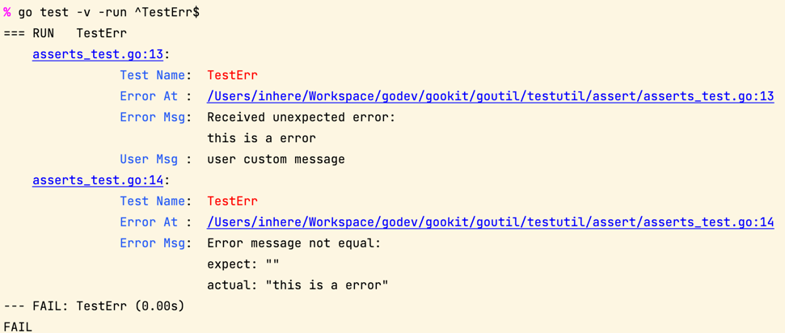

# Test Utils

`testutil` provide some test help util functions. eg: http test, mock ENV value

- `assert` go tests helper
- env variable mocks
- http request mock 

## Install

```bash
go get github.com/gookit/goutil/testutil
```

## [`assert`](./assert) tests

```go
package assert_test

import (
	"testing"

	"github.com/gookit/goutil/errorx"
	"github.com/zhangyiming748/pretty/testutil/assert"
)

func TestErr(t *testing.T) {
	err := errorx.Raw("this is a error")

	assert.NoErr(t, err, "user custom message")
	assert.ErrMsg(t, err, "this is a error")
}
```

Run tests for special method:

```shell
go test -v -run ^TestErr$
go test -v -run ^TestErr$ ./testutil/assert/...
```

**Error on fail**:



## Mock for tests

## More test utils

### Wraps buffer

`testutil.Buffer` is wraps the `bytes.Buffer` and useful for testing.
Will not return error on call WriteX methods

```go
func (b *Buffer) WriteString(ss ...string) // will not return error
func (b *Buffer) WriteAny(vs ...interface{})
func (b *Buffer) ResetAndGet() string
```

### Wraps writer

`testutil.TestWriter` is wraps the `testutil.Buffer`.
it can be custom return error on write, close, flush.

Examples:

```go
package testutil_test

import (
	"testing"

	"github.com/gookit/goutil/testutil"
	"github.com/zhangyiming748/pretty/testutil/assert"
)

func TestNewTestWriter(t *testing.T) {
	tw := testutil.NewTestWriter()
	_, err := tw.Write([]byte("hello"))
	assert.NoErr(t, err)
	assert.Eq(t, "hello", tw.String())
	assert.NoErr(t, tw.Flush())
	assert.Eq(t, "", tw.String())
	assert.NoErr(t, tw.Close())

	tw.SetErrOnWrite()
	_, err = tw.Write([]byte("hello"))
	assert.Err(t, err)
	assert.Eq(t, "", tw.String())

	tw.SetErrOnFlush()
	assert.Err(t, tw.Flush())

	tw.SetErrOnClose()
	assert.Err(t, tw.Close())
}
```

## Functions API

```go
func ClearOSEnv()
func DiscardStdout() error
func MockCleanOsEnv(mp map[string]string, fn func())
func MockEnvValue(key, val string, fn func(nv string))
func MockEnvValues(kvMap map[string]string, fn func())
func MockOsEnv(mp map[string]string, fn func())
func MockOsEnvByText(envText string, fn func())
func MockRequest(h http.Handler, method, path string, data *MD) *httptest.ResponseRecorder
func NewHttpRequest(method, path string, data *MD) *http.Request
func RestoreStderr(printData ...bool) (s string)
func RestoreStdout(printData ...bool) (s string)
func RevertOSEnv()
func RewriteStderr()
func RewriteStdout()
type Buffer struct{ ... }
    func NewBuffer() *Buffer
type M map[string]string
type MD struct{ ... }
type TestWriter struct{ ... }
    func NewTestWriter() *TestWriter
```

## Code Check & Testing

```bash
gofmt -w -l ./
golint ./...
go test ./...
```

**Testing in docker**:

```shell
cd goutil
docker run -ti -v $(pwd):/go/work golang:1.18
root@xx:/go/work# go test ./...
```

Upgrade `interface{}` to `any`:

```shell
# 查看此次替换会影响到的源文件列表
gofmt -l -r 'interface{} -> any' .
# do 
gofmt -w -r 'interface{} -> any' .
```
